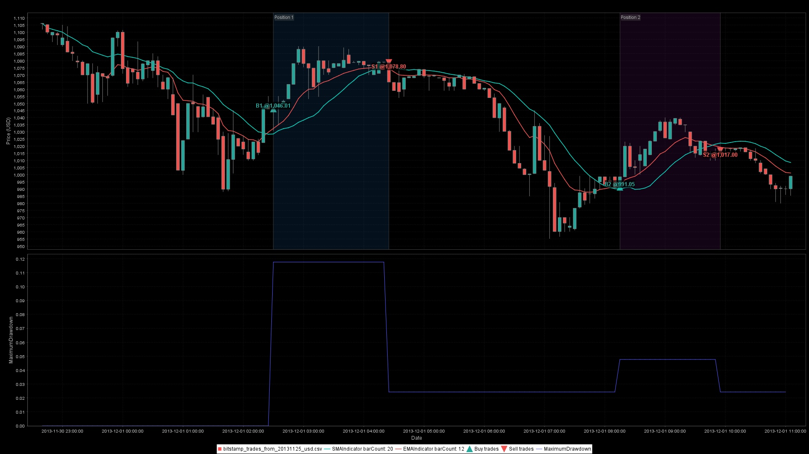
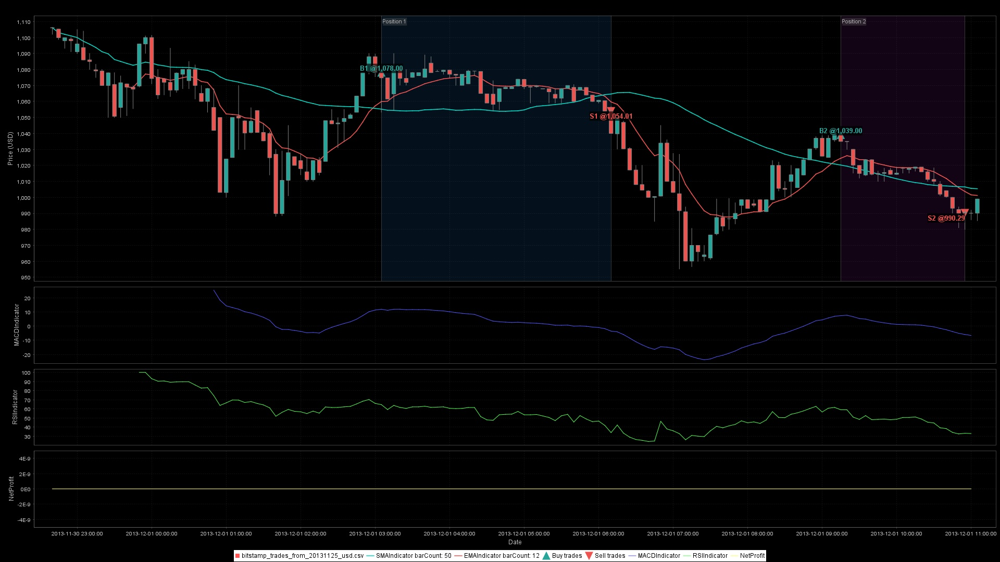

# ta4j  [](https://github.com/ta4j/ta4j/actions/workflows/test.yml) [](https://discord.gg/HX9MbWZ) [](https://opensource.org/licenses/MIT)  

***Technical Analysis for Java***


Build, test, and deploy trading bots in Java. With 200+ (and counting) technical indicators, intuitive APIs, and production-minded tooling, you can explore markets, validate trading ideas, visualize signals, and ship automated bots without leaving the JVM.

---

## Table of Contents

- [Why Ta4j?](#why-ta4j)
- [Install in seconds](#install-in-seconds)
- [Build commands: Maven Wrapper or Maven](#build-commands-maven-wrapper-or-maven)
- [Quick start: Your first strategy](#quick-start-your-first-strategy)
- [Sourcing market data](#sourcing-market-data)
- [Visualize and share strategies](#visualize-and-share-strategies)
- [Features at a glance](#features-at-a-glance)
- [Evaluate performance with metrics](#evaluate-performance-with-metrics)
- [From backtest to live trading](#from-backtest-to-live-trading)
- [Real-world examples](#real-world-examples)
- [Performance](#performance)
- [Community & Support](#community--support)
- [What's next?](#whats-next)
- [Contributing](#contributing)

---

## Why Ta4j?

**Build, test, and deploy trading strategies in Java** without leaving your preferred language, toolchain, or mental model. Ta4j provides the building blocks needed to explore markets, validate ideas, and move from curiosity to production-grade systems.

Ta4j treats technical analysis for what it is: a structured way to reason about uncertainty using historical price data. As often stated, past performance is no guarantee of future results. History doesn't repeat, but it often rhymes. Technical indicators are about probabilities rather than predictions. They help us understand the art of the possible and, when used well, the art of alpha from the probable. 

> **⚡ Performance Advantage**: Native multi-threading gives ta4j a significant comparative advantage over Python-based libraries. Backtest hundreds of strategies in parallel, process years of market data in seconds, and saturate all CPU cores. No GIL bottleneck, no multiprocessing workarounds, just straightforward parallel execution.

Because Ta4j runs on the JVM, strategies scale naturally from a single backtest on a laptop to large parameter sweeps, portfolio simulations, and research pipelines. Strong typing and explicit models make strategies easier to reason about, harder to misuse, and less likely to quietly do the wrong thing.

Ta4j does not promise profitable strategies. It promises reproducible experiments. If a strategy looks good, Ta4j helps you verify it. If it stops working, Ta4j helps you understand why. And if a backtest looks too good to be true, it's on you to choose skepticism over motivated thinking.


### What can you build?

- **Backtest trading strategies**: Test "what if" scenarios on historical data before risking real money
- **Paper trading bots**: Run strategies live against market data without placing real orders
- **Research tools**: Analyze market patterns, compare indicators, and explore new trading ideas
- **Automated trading systems**: Deploy production bots that execute trades based on your strategies
- **Market analysis dashboards**: Build visualizations and reports for your trading research

### Why Java developers choose Ta4j

- **Pure Java, zero friction**: Works anywhere Java 21+ runs - cloud functions, desktop tools, microservices, or trading bots. No Python bridges or external dependencies.
- **Type-safe, Production-ready**: Ta4j favors explicit models, strong typing, and predictable performance over exploratory scripting. Deterministic outputs, JSON serialization for strategies/indicators, and minimal dependencies make it easy to deploy.
- **Huge indicator catalog**: Aroon, ATR, Ichimoku, MACD, RSI, Renko, Heikin-Ashi, and 190+ more ready to plug together. New indicators are added regularly based on community needs and contributions.
- **Composable strategies**: Chain rules fluently using familiar Java patterns - no DSLs or configuration files required.
- **Backtesting built-in**: Evaluate risk/reward with realistic trading costs and performance metrics in just a few lines.
- **MIT licensed**: Use it at work, in research, or inside your next trading product without legal concerns.

## Install in seconds

Add Ta4j from Maven Central:

<!-- TA4J_VERSION_BLOCK:core:stable:begin -->

```xml
<dependency>
  <groupId>org.ta4j</groupId>
  <artifactId>ta4j-core</artifactId>
  <version>0.22.2</version>
</dependency>
```

<!-- TA4J_VERSION_BLOCK:core:stable:end -->

Prefer living on the edge? Use the snapshot repository and version:

<!-- TA4J_VERSION_BLOCK:core:snapshot:begin -->

```xml
<repository>
  <id>central-portal-snapshots</id>
  <url>https://central.sonatype.com/repository/maven-snapshots/</url>
</repository>

<dependency>
  <groupId>org.ta4j</groupId>
  <artifactId>ta4j-core</artifactId>
  <version>0.22.3-SNAPSHOT</version>
</dependency>
```

<!-- TA4J_VERSION_BLOCK:core:snapshot:end -->

Sample applications are also published so you can copy/paste entire flows:

<!-- TA4J_VERSION_BLOCK:examples:stable:begin -->

```xml
<dependency>
  <groupId>org.ta4j</groupId>
  <artifactId>ta4j-examples</artifactId>
  <version>0.22.2</version>
</dependency>
```

<!-- TA4J_VERSION_BLOCK:examples:stable:end -->

Like living on the edge? Use the snapshot version of ta4j-examples for the latest experimental/beta features:

<!-- TA4J_VERSION_BLOCK:examples:snapshot:begin -->

```xml
<dependency>
  <groupId>org.ta4j</groupId>
  <artifactId>ta4j-examples</artifactId>
  <version>0.22.3-SNAPSHOT</version>
</dependency>
```

<!-- TA4J_VERSION_BLOCK:examples:snapshot:end -->

**💡 Tip**: The `ta4j-examples` module includes runnable demos, data loaders, and charting utilities. It's a great way to see Ta4j in action and learn by example.

## Build commands: Maven Wrapper or Maven

Ta4j supports both approaches:

- **Maven Wrapper (recommended):** Uses the repository-pinned Maven version and avoids requiring a global Maven installation.
  Linux/macOS/Git Bash: `./mvnw ...`
  Windows CMD/PowerShell: `mvnw.cmd ...`
- **System Maven (optional):** Use `mvn ...` if you prefer your local Maven installation.

## Try it now

**Option 1: Run the Quickstart example** (2-3 minutes)

```bash
# Clone the repository
git clone https://github.com/ta4j/ta4j.git
cd ta4j

# Build the project first (Linux/macOS/Git Bash)
./mvnw clean install -DskipTests
# Windows CMD/PowerShell: mvnw.cmd clean install -DskipTests

# Run the Quickstart example (Quickstart is configured as the default)
./mvnw -pl ta4j-examples exec:java
# Windows CMD/PowerShell: mvnw.cmd -pl ta4j-examples exec:java
```

Prefer system Maven? Use the same commands with `mvn` instead of `./mvnw` or `mvnw.cmd`.

**Alternative:** To run a different example class:
```bash
# On Linux/Mac/Git Bash
./mvnw -pl ta4j-examples exec:java -Dexec.mainClass=ta4jexamples.Quickstart

# On Windows CMD (use quotes)
mvnw.cmd -pl ta4j-examples exec:java "-Dexec.mainClass=ta4jexamples.Quickstart"
```

This will load historical Bitcoin data, run a complete trading strategy, display performance metrics, and show an interactive chart - all in one go!

**Option 2: Copy the code into your project** (requires `ta4j-core` and `ta4j-examples` dependencies)

See the [Quick start: Your first strategy](#quick-start-your-first-strategy) section below for a complete, runnable example you can paste into your IDE.

## Quick start: Your first strategy

Load price data, plug in indicators, and describe when to enter/exit. The API reads like the trading notes you already keep.

**💡 Want to see this in action?** The [`Quickstart` example](https://github.com/ta4j/ta4j/blob/master/ta4j-examples/src/main/java/ta4jexamples/Quickstart.java) includes this same pattern plus performance metrics and charting. Run it with:
```bash
./mvnw -pl ta4j-examples exec:java -Dexec.mainClass=ta4jexamples.Quickstart
```

**Key concepts:**
- **Indicators**: Calculate values from price data (e.g., moving averages, RSI, MACD)
- **Rules**: Boolean conditions that determine when to enter or exit trades
- **Strategies**: Combine entry and exit rules into a complete trading system
- **BarSeries**: Your price data (OHLCV bars) that everything operates on

**Note:** The example below uses `BitStampCsvTradesFileBarSeriesDataSource` from `ta4j-examples` for convenience. See the [Sourcing market data](#sourcing-market-data) section below for more options.

```java
import org.ta4j.core.*;
import org.ta4j.core.indicators.EMAIndicator;
import org.ta4j.core.indicators.helpers.ClosePriceIndicator;
import org.ta4j.core.rules.*;
import org.ta4j.core.backtest.BarSeriesManager;
import ta4jexamples.datasources.BitStampCsvTradesFileBarSeriesDataSource;  // Requires ta4j-examples dependency

// Load historical price data (or use your own data source)
BarSeries series = BitStampCsvTradesFileBarSeriesDataSource.loadBitstampSeries();

// Create indicators: calculate moving averages from close prices
ClosePriceIndicator close = new ClosePriceIndicator(series);
EMAIndicator fastEma = new EMAIndicator(close, 12);  // 12-period EMA
EMAIndicator slowEma = new EMAIndicator(close, 26);  // 26-period EMA

// Define entry rule: buy when fast EMA crosses above slow EMA (golden cross)
Rule entry = new CrossedUpIndicatorRule(fastEma, slowEma);

// Define exit rule: sell when price gains 3% OR loses 1.5%
Rule exit = new StopGainRule(close, 3.0)      // take profit at +3%
        .or(new StopLossRule(close, 1.5));    // or cut losses at -1.5%

// Combine rules into a strategy
Strategy strategy = new BaseStrategy("EMA Crossover", entry, exit);

// Run the strategy on historical data
BarSeriesManager manager = new BarSeriesManager(series);
TradingRecord record = manager.run(strategy);

// See the results
System.out.println("Number of trades: " + record.getTradeCount());
System.out.println("Number of positions: " + record.getPositionCount());
```

## Sourcing market data

**New to trading and not sure where to get historical price data?** You're not alone! Ta4j makes it easy to get started with real market data using the unified `BarSeriesDataSource` interface. All data sources work with the same domain-driven API using business concepts like ticker symbols, intervals, and date ranges.

### Quick solution: Yahoo Finance (no API key required)

The easiest way to get started is using the built-in `YahooFinanceHttpBarSeriesDataSource` from `ta4j-examples`. It fetches real market data from Yahoo Finance's public API - no registration or API key needed.

**Using the unified interface (recommended):**
```java
import ta4jexamples.datasources.YahooFinanceHttpBarSeriesDataSource;
import java.time.Duration;
import java.time.Instant;

// Enable response caching to avoid hitting API limits during development
YahooFinanceHttpBarSeriesDataSource dataSource = new YahooFinanceHttpBarSeriesDataSource(true);

// Load data using the unified interface (works with any data source)
BarSeries series = dataSource.loadSeries("AAPL", 
    Duration.ofDays(1),  // Daily bars
    Instant.parse("2023-01-01T00:00:00Z"),
    Instant.parse("2023-12-31T23:59:59Z"));
```

**Using convenience methods:**
```java
// Load by bar count (e.g., 2 years of daily candles)
BarSeries series = dataSource.loadSeriesInstance("AAPL", 
    YahooFinanceHttpBarSeriesDataSource.YahooFinanceInterval.DAY_1, 730);

// Or use static convenience methods
BarSeries series = YahooFinanceHttpBarSeriesDataSource.loadSeries("AAPL", 365); // 1 year of daily data
BarSeries series = YahooFinanceHttpBarSeriesDataSource.loadSeries("BTC-USD", 
    YahooFinanceHttpBarSeriesDataSource.YahooFinanceInterval.HOUR_1, 500); // 500 hourly bars
```

**Supported assets:**
- **Stocks**: `"AAPL"`, `"MSFT"`, `"GOOGL"`, `"TSLA"`, etc.
- **ETFs**: `"SPY"`, `"QQQ"`, `"VTI"`, etc.
- **Cryptocurrencies**: `"BTC-USD"`, `"ETH-USD"`, `"SOL-USD"`, etc.

**Supported intervals:**
- Intraday: `MINUTE_1`, `MINUTE_5`, `MINUTE_15`, `MINUTE_30`, `HOUR_1`, `HOUR_4`
- Daily/weekly/monthly: `DAY_1`, `WEEK_1`, `MONTH_1`

**💡 Tip:** Enable caching (`new YahooFinanceHttpBarSeriesDataSource(true)`) to cache API responses locally. This speeds up development and reduces API calls. Cached data is automatically reused for the same requests.

**See it in action:** Run the complete example with:
```bash
./mvnw -pl ta4j-examples exec:java -Dexec.mainClass=ta4jexamples.backtesting.YahooFinanceBacktest
```

This example demonstrates loading data from Yahoo Finance, building an advanced multi-indicator strategy (Bollinger Bands, RSI, ATR stops), running a backtest, and visualizing results.

### Coinbase (cryptocurrency data)

For cryptocurrency data, use `CoinbaseHttpBarSeriesDataSource` which fetches data from Coinbase's public market data API. No authentication required.

```java
import ta4jexamples.datasources.CoinbaseHttpBarSeriesDataSource;
import java.time.Duration;
import java.time.Instant;

// Enable response caching
CoinbaseHttpBarSeriesDataSource dataSource = new CoinbaseHttpBarSeriesDataSource(true);

// Using the unified interface
BarSeries series = dataSource.loadSeries("BTC-USD", 
    Duration.ofDays(1),
    Instant.parse("2023-01-01T00:00:00Z"),
    Instant.parse("2023-12-31T23:59:59Z"));

// Or use convenience methods
BarSeries series = CoinbaseHttpBarSeriesDataSource.loadSeries("BTC-USD", 365); // 1 year of daily data
BarSeries series = dataSource.loadSeriesInstance("ETH-USD", 
    CoinbaseHttpBarSeriesDataSource.CoinbaseInterval.ONE_HOUR, 500); // 500 hourly bars
```

**Supported trading pairs:** All Coinbase trading pairs (e.g., `"BTC-USD"`, `"ETH-USD"`, `"SOL-USD"`)

**API limits:** Coinbase API has a maximum of 350 candles per request. The implementation automatically paginates large requests into multiple API calls and merges the results.

**See it in action:** Run the complete example with:
```bash
./mvnw -pl ta4j-examples exec:java -Dexec.mainClass=ta4jexamples.backtesting.CoinbaseBacktest
```

### Other data sources

Ta4j works with any OHLCV (Open, High, Low, Close, Volume) data. The `ta4j-examples` module includes implementations for several data sources, all using the unified `BarSeriesDataSource` interface:

- **[YahooFinanceHttpBarSeriesDataSource](ta4j-examples/src/main/java/ta4jexamples/datasources/YahooFinanceHttpBarSeriesDataSource.java)** - Fetch live data from Yahoo Finance API (stocks, ETFs, crypto) with optional response caching
- **[CoinbaseHttpBarSeriesDataSource](ta4j-examples/src/main/java/ta4jexamples/datasources/CoinbaseHttpBarSeriesDataSource.java)** - Load historical crypto data from Coinbase's public API with automatic caching and pagination
- **[CsvFileBarSeriesDataSource](ta4j-examples/src/main/java/ta4jexamples/datasources/CsvFileBarSeriesDataSource.java)** - Load OHLCV data from CSV files with intelligent filename pattern matching
- **[JsonFileBarSeriesDataSource](ta4j-examples/src/main/java/ta4jexamples/datasources/JsonFileBarSeriesDataSource.java)** - Load Coinbase/Binance-style JSON bar data with flexible date filtering
- **[BitStampCsvTradesFileBarSeriesDataSource](ta4j-examples/src/main/java/ta4jexamples/datasources/BitStampCsvTradesFileBarSeriesDataSource.java)** - Aggregate Bitstamp trade-level CSV data into bars on-the-fly

**All data sources share the same interface:**
```java
BarSeriesDataSource yahoo = new YahooFinanceHttpBarSeriesDataSource(true);
BarSeriesDataSource coinbase = new CoinbaseHttpBarSeriesDataSource(true);
BarSeriesDataSource csv = new CsvFileBarSeriesDataSource();

// Same interface, different implementations
BarSeries aapl = yahoo.loadSeries("AAPL", Duration.ofDays(1), start, end);
BarSeries btc = coinbase.loadSeries("BTC-USD", Duration.ofDays(1), start, end);
BarSeries eth = csv.loadSeries("ETH-USD", Duration.ofDays(1), start, end);
```

**Create your own data source:** Simply implement the `BarSeriesDataSource` interface. You can load data from:
- CSV files
- REST APIs (your broker, exchange, or data provider)
- Databases (SQL, NoSQL)
- WebSocket streams (for live data)
- Any other source you prefer

See the [Data Loading Examples](#real-world-examples) section for more details.

## Evaluate performance with metrics

Turn ideas into numbers. Add trading costs for realism and measure what matters: returns, risk, drawdowns, and more.

```java
import org.ta4j.core.criteria.pnl.NetReturnCriterion;
import org.ta4j.core.criteria.drawdown.MaximumDrawdownCriterion;
import org.ta4j.core.cost.LinearTransactionCostModel;
import org.ta4j.core.cost.LinearBorrowingCostModel;

// Run backtest with realistic trading costs
// Transaction cost: 0.1% per trade (typical for crypto exchanges)
// Borrowing cost: 0.01% per period (for margin/short positions)
TradingRecord record = new BarSeriesManager(series,
        new LinearTransactionCostModel(0.001),      // 0.1% fee per trade
        new LinearBorrowingCostModel(0.0001))       // 0.01% borrowing cost
        .run(strategy);

// Calculate performance metrics
System.out.printf("Trades executed: %d%n", record.getTradeCount());
System.out.printf("Net return: %.2f%%%n", 
    new NetReturnCriterion().calculate(series, record).multipliedBy(series.numOf(100)));
System.out.printf("Max drawdown: %.2f%%%n", 
    new MaximumDrawdownCriterion().calculate(series, record).multipliedBy(series.numOf(100)));

// Explore more metrics: Sharpe ratio, win rate, profit factor, etc.
// See the wiki for the full list of available criteria
```

### Backtest hundreds or even thousands of strategies

Want to find the top performers? Generate strategies with varying parameters and compare them:

```java
// Generate strategies with varying parameters
List<Strategy> strategies = new ArrayList<>();
for (int fastPeriod = 5; fastPeriod <= 20; fastPeriod += 5) {
    for (int slowPeriod = 20; slowPeriod <= 50; slowPeriod += 10) {
        EMAIndicator fastEma = new EMAIndicator(close, fastPeriod);
        EMAIndicator slowEma = new EMAIndicator(close, slowPeriod);
        Rule entry = new CrossedUpIndicatorRule(fastEma, slowEma);
        Rule exit = new CrossedDownIndicatorRule(fastEma, slowEma);
        strategies.add(new BaseStrategy("EMA(" + fastPeriod + "," + slowPeriod + ")", entry, exit));
    }
}

// Run all strategies with progress tracking
BacktestExecutionResult result = new BacktestExecutor(series)
    .executeWithRuntimeReport(strategies, 
        series.numFactory().numOf(1),  // position size: 1 unit
        Trade.TradeType.BUY,           // long positions (use Trade.TradeType.SELL for shorts)
        ProgressCompletion.loggingWithMemory()); // logs progress with memory stats

// Get top 10 strategies sorted by net profit, then by RoMaD (for ties)
// You can sort by any combination of AnalysisCriterion - mix and match to find strategies that meet your goals
AnalysisCriterion returnOverMaxDradownCriterion = new ReturnOverMaxDrawdownCriterion();
AnalysisCriterion netProfitCriterion = new NetProfitCriterion();

List<TradingStatement> topStrategies = result.getTopStrategies(10,
    netProfitCriterion,    // primary sort: highest net profit first
    returnOverMaxDradownCriterion);  // secondary sort: highest RoMaD for ties

// Review the winners
topStrategies.forEach(statement -> {
    System.out.printf("Strategy: %s, Net Profit: %.2f, Return over Max Drawdown: %.2f%n",
        statement.getStrategy().getName(),
        statement.getCriterionScore(netProfitCriterion).orElse(series.numOf(0)),
        statement.getCriterionScore(returnOverMaxDradownCriterion).orElse(series.numOf(0)));
});
```

It’s not uncommon for a first backtest to look promising. Very promising. Resist the urge to extrapolate annualized returns, quit your job, or price out yachts.


## Visualize and share strategies

See your strategies in action. Ta4j includes charting helpers, but you're not locked in - serialize to JSON and use any visualization stack you prefer.

**Built-in Java charting** (using JFreeChart):

Basic strategy visualization with indicator overlays:
<!-- START_SNIPPET: ema-crossover -->
```java
// Generate simplified chart - just price, indicators, and signals (no subchart)
ChartWorkflow chartWorkflow = new ChartWorkflow();
JFreeChart chart = chartWorkflow.builder()
        .withTitle("EMA Crossover Strategy")
        .withTimeAxisMode(TimeAxisMode.BAR_INDEX) // Optional: compress non-trading gaps (weekends/holidays)
        .withSeries(series) // Price bars (candlesticks)
        .withIndicatorOverlay(fastEma) // Overlay indicators on price chart
        .withIndicatorOverlay(slowEma)
        .withTradingRecordOverlay(record) // Mark entry/exit points with arrows
        .toChart();
chartWorkflow.saveChartImage(chart, series, "ema-crossover-strategy", "output/charts"); // Save as image
```
<!-- END_SNIPPET: ema-crossover -->


The chart above shows candlestick price data with EMA lines overlaid and buy/sell signals marked with arrows. This demonstrates basic strategy visualization with indicator overlays.
Use `TimeAxisMode.BAR_INDEX` when you want to remove visual gaps from weekends or market holidays while keeping the underlying bar timestamps intact.

If you need to inspect or customize a chart before rendering, call `toPlan()` and review `plan.context()`/`plan.metadata()` for the shared title, domain series, and time axis mode. The same metadata drives consistent title styling across chart types when you render or save charts.

**Adding indicator subcharts** for indicators with different scales (like RSI, which ranges from 0-100):
<!-- START_SNIPPET: rsi-strategy -->
```java
// Create indicators
ClosePriceIndicator close = new ClosePriceIndicator(series);
RSIIndicator rsi = new RSIIndicator(close, 14);

// RSI strategy: buy when RSI crosses below 30 (oversold), sell when RSI crosses
// above 70 (overbought)
Rule entry = new CrossedDownIndicatorRule(rsi, 30);
Rule exit = new CrossedUpIndicatorRule(rsi, 70);
Strategy strategy = new BaseStrategy("RSI Strategy", entry, exit);
TradingRecord record = new BarSeriesManager(series).run(strategy);

ChartWorkflow chartWorkflow = new ChartWorkflow();
JFreeChart chart = chartWorkflow.builder()
        .withTitle("RSI Strategy with Subchart")
        .withSeries(series) // Price bars (candlesticks)
        .withTradingRecordOverlay(record) // Mark entry/exit points
        .withSubChart(rsi) // RSI indicator in separate subchart panel
        .toChart();
```
<!-- END_SNIPPET: rsi-strategy -->


**Visualizing performance metrics** alongside your strategy:
<!-- START_SNIPPET: strategy-performance -->
```java
// Create indicators: multiple moving averages
ClosePriceIndicator close = new ClosePriceIndicator(series);
SMAIndicator sma20 = new SMAIndicator(close, 20);
EMAIndicator ema12 = new EMAIndicator(close, 12);

// Strategy: buy when EMA crosses above SMA, sell when EMA crosses below SMA
Rule entry = new CrossedUpIndicatorRule(ema12, sma20);
Rule exit = new CrossedDownIndicatorRule(ema12, sma20);
Strategy strategy = new BaseStrategy("EMA/SMA Crossover", entry, exit);
TradingRecord record = new BarSeriesManager(series).run(strategy);

ChartWorkflow chartWorkflow = new ChartWorkflow();
JFreeChart chart = chartWorkflow.builder()
        .withTitle("Strategy Performance Analysis")
        .withSeries(series) // Price bars (candlesticks)
        .withIndicatorOverlay(sma20) // Overlay SMA on price chart
        .withIndicatorOverlay(ema12) // Overlay EMA on price chart
        .withTradingRecordOverlay(record) // Mark entry/exit points
        .withSubChart(new MaximumDrawdownCriterion(), record) // Performance metric in subchart
        .toChart();
```
<!-- END_SNIPPET: strategy-performance -->



This chart shows price action with indicator overlays, trading signals, and a performance subchart displaying maximum drawdown over time - helping you understand risk alongside returns.

**Advanced multi-indicator analysis** with multiple subcharts:
<!-- START_SNIPPET: advanced-strategy -->
```java
// Create indicators
ClosePriceIndicator close = new ClosePriceIndicator(series);
SMAIndicator sma50 = new SMAIndicator(close, 50);
EMAIndicator ema12 = new EMAIndicator(close, 12);
MACDIndicator macd = new MACDIndicator(close, 12, 26);
RSIIndicator rsi = new RSIIndicator(close, 14);

// Strategy: buy when EMA crosses above SMA and RSI > 50, sell when EMA crosses
// below SMA
Rule entry = new CrossedUpIndicatorRule(ema12, sma50).and(new OverIndicatorRule(rsi, 50));
Rule exit = new CrossedDownIndicatorRule(ema12, sma50);
Strategy strategy = new BaseStrategy("Advanced Multi-Indicator Strategy", entry, exit);
TradingRecord record = new BarSeriesManager(series).run(strategy);

ChartWorkflow chartWorkflow = new ChartWorkflow();
JFreeChart chart = chartWorkflow.builder()
        .withTitle("Advanced Multi-Indicator Strategy")
        .withSeries(series) // Price bars (candlesticks)
        .withIndicatorOverlay(sma50) // Overlay SMA on price chart
        .withIndicatorOverlay(ema12) // Overlay EMA on price chart
        .withTradingRecordOverlay(record) // Mark entry/exit points
        .withSubChart(macd) // MACD indicator in subchart
        .withSubChart(rsi) // RSI indicator in subchart
        .withSubChart(new NetProfitLossCriterion(), record) // Net profit/loss performance metric
        .toChart();
```
<!-- END_SNIPPET: advanced-strategy -->



This comprehensive chart demonstrates combining multiple indicators (MACD, RSI) in separate subcharts with performance metrics, giving you a complete view of strategy behavior.

See the chart at the top of this README for another example, or check the [wiki's charting guide](https://ta4j.github.io/ta4j-wiki/Charting.html) for more examples.

**Export to any stack** (Python, TypeScript, etc.):

Serialize indicators, rules, and strategies to JSON for persistence, sharing, or integration with other systems:

<!-- START_SNIPPET: serialize-indicator -->
```java
// Serialize an indicator (RSI) to JSON
ClosePriceIndicator close = new ClosePriceIndicator(series);
RSIIndicator rsi = new RSIIndicator(close, 14);
String rsiJson = rsi.toJson();
LOG.info("Output: {}", rsiJson);
// Output:
// {"type":"RSIIndicator","parameters":{"barCount":14},"components":[{"type":"ClosePriceIndicator"}]}
```
<!-- END_SNIPPET: serialize-indicator -->

<!-- START_SNIPPET: serialize-rule -->
```java
// Serialize a rule (AndRule) to JSON
Rule rule1 = new OverIndicatorRule(rsi, 50);
Rule rule2 = new UnderIndicatorRule(rsi, 80);
Rule andRule = new AndRule(rule1, rule2);
String ruleJson = ComponentSerialization.toJson(RuleSerialization.describe(andRule));
LOG.info("Output: {}", ruleJson);
// Output:
// {"type":"AndRule","label":"AndRule","components":[{"type":"OverIndicatorRule","label":"OverIndicatorRule","components":[{"type":"RSIIndicator","parameters":{"barCount":14},"components":[{"type":"ClosePriceIndicator"}]}],"parameters":{"threshold":50.0}},{"type":"UnderIndicatorRule","label":"UnderIndicatorRule","components":[{"type":"RSIIndicator","parameters":{"barCount":14},"components":[{"type":"ClosePriceIndicator"}]}],"parameters":{"threshold":80.0}}]}
```
<!-- END_SNIPPET: serialize-rule -->

<!-- START_SNIPPET: serialize-strategy -->
```java
// Serialize a strategy (EMA Crossover) to JSON
EMAIndicator fastEma = new EMAIndicator(close, 12);
EMAIndicator slowEma = new EMAIndicator(close, 26);
Rule entry = new CrossedUpIndicatorRule(fastEma, slowEma);
Rule exit = new CrossedDownIndicatorRule(fastEma, slowEma);
Strategy strategy = new BaseStrategy("EMA Crossover", entry, exit);
String strategyJson = strategy.toJson();
LOG.info("Output: {}", strategyJson);
// Output: {"type":"BaseStrategy","label":"EMA
// Crossover","parameters":{"unstableBars":0},"rules":[{"type":"CrossedUpIndicatorRule","label":"entry","components":[{"type":"EMAIndicator","parameters":{"barCount":12},"components":[{"type":"ClosePriceIndicator"}]},{"type":"EMAIndicator","parameters":{"barCount":26},"components":[{"type":"ClosePriceIndicator"}]}]},{"type":"CrossedDownIndicatorRule","label":"exit","components":[{"type":"EMAIndicator","parameters":{"barCount":12},"components":[{"type":"ClosePriceIndicator"}]},{"type":"EMAIndicator","parameters":{"barCount":26},"components":[{"type":"ClosePriceIndicator"}]}]}]}
```
<!-- END_SNIPPET: serialize-strategy -->

Restore from JSON:
```java
// Restore indicators and strategies from JSON
Indicator<?> restoredIndicator = Indicator.fromJson(series, rsiJson);
Strategy restoredStrategy = Strategy.fromJson(series, strategyJson);
```

Bar series serialization (Java):
- Bar data, the `NumFactory`, and the `BarBuilderFactory` configuration are preserved across the round-trip.
- `ConcurrentBarSeries` reinitializes its locks after deserialization and recreates the trade bar builder lazily.
- Builder state (for example, a time period set directly on the builder) must be re-applied after deserialization unless you configured it in the factory.

## Features at a glance

- **190+ technical indicators (and counting)** - Aroon, ATR, Ichimoku, MACD, RSI, Renko, Heikin-Ashi, and many more. New indicators are added regularly.
- **Composable strategy API** - Build complex trading rules using fluent Java patterns
- **Built-in backtesting engine** - Test strategies on years of data in seconds. Same code for backtesting and live trading — no rewrites.
- **Performance metrics** - 30+ analysis criteria including Sharpe ratio, drawdown, win rate, and more
- **Charting support** - Visualize strategies with candlestick charts, indicator overlays, and performance subcharts
- **JSON serialization** - Save and restore strategies and indicators for persistence and sharing
- **Production-ready** - Deterministic calculations, minimal dependencies, type-safe APIs
- **Extensive examples** - Runnable demos covering strategies, indicators, backtesting, and live trading

## From backtest to live trading

The same strategies you backtest can run live. Ta4j's deterministic calculations make it safe to deploy & test thoroughly, then execute with confidence.

```java
import org.ta4j.core.builder.BaseBarSeriesBuilder;

// Create a live series (starts empty, grows as bars arrive)
BarSeries liveSeries = new BaseBarSeriesBuilder()
        .withName("BTC-USD")
        .build();

// Build your strategy (same code as backtesting!)
Strategy strategy = buildStrategy(liveSeries);

// Main trading loop: check for signals on each new bar
while (true) {
    // Fetch latest bar from your exchange/broker API
    Bar latest = fetchLatestBarFromBroker();  // Your integration here
    liveSeries.addBar(latest);

    int endIndex = liveSeries.getEndIndex();
    
    // Check entry/exit signals (same API as backtesting)
    if (strategy.shouldEnter(endIndex)) {
        placeBuyOrder();  // Your order execution logic
    } else if (strategy.shouldExit(endIndex)) {
        placeSellOrder(); // Your order execution logic
    }
    
    Thread.sleep(60000); // Wait 1 minute (or your bar interval)
}
```

**Why this works:**
- **Same code, different data**: Your strategy logic is identical for backtests and live trading
- **Deterministic**: Same inputs always produce same outputs - critical for testing and debugging
- **Type-safe**: Compile-time checks catch errors before they cost money

## Recording live executions

When you route orders to an exchange, record the fills in a `LiveTradingRecord`. It tracks partial fills, multiple open
lots, and recorded fees so analytics can include open exposure.

```java
import java.time.Instant;

import org.ta4j.core.ExecutionFill;
import org.ta4j.core.ExecutionMatchPolicy;
import org.ta4j.core.ExecutionSide;
import org.ta4j.core.LiveTrade;
import org.ta4j.core.LiveTradingRecord;
import org.ta4j.core.Trade.TradeType;
import org.ta4j.core.analysis.CashFlow;
import org.ta4j.core.analysis.EquityCurveMode;
import org.ta4j.core.analysis.OpenPositionHandling;
import org.ta4j.core.analysis.cost.ZeroCostModel;

LiveTradingRecord record = new LiveTradingRecord(
        TradeType.BUY,
        ExecutionMatchPolicy.FIFO,
        new ZeroCostModel(),
        new ZeroCostModel(),
        null,
        null);

record.recordFill(new LiveTrade(
        barIndex,
        Instant.now(),
        price,
        amount,
        fee,
        ExecutionSide.BUY,
        orderId,
        correlationId));

// If you already have exchange DTOs mapped to ExecutionFill, use the generic API.
ExecutionFill exchangeFill = mapExchangeFill();
record.recordExecutionFill(exchangeFill);

CashFlow equity = new CashFlow(series, record, EquityCurveMode.MARK_TO_MARKET,
        OpenPositionHandling.MARK_TO_MARKET);
var latest = equity.getValue(series.getEndIndex());
```

Notes:
- `ExecutionMatchPolicy.SPECIFIC_ID` matches exits to the lot with a matching `correlationId` or `orderId`.
- After deserializing a `LiveTradingRecord`, call `rehydrate(holdingCostModel)` to restore transient cost models.

## Streaming trade ingestion (gap handling)

When you need to aggregate raw trades into time bars, use `ConcurrentBarSeries` with a `TimeBarBuilderFactory`:

```java
import java.time.Duration;
import java.time.Instant;

import org.ta4j.core.Bar;
import org.ta4j.core.ConcurrentBarSeries;
import org.ta4j.core.ConcurrentBarSeriesBuilder;
import org.ta4j.core.bars.TimeBarBuilderFactory;

ConcurrentBarSeries series = new ConcurrentBarSeriesBuilder()
        .withName("BTC-USD")
        .withBarBuilderFactory(new TimeBarBuilderFactory(Duration.ofMinutes(1)))
        .build();

Instant t0 = Instant.parse("2024-01-01T10:05:00Z");
series.ingestTrade(t0, 1, 100);
series.ingestTrade(t0.plusSeconds(150), 2, 105); // skips the 10:06 bar

LOG.info("Bars: {}", series.getBarCount()); // 2
LOG.info("Second bar begin: {}", series.getBar(1).getBeginTime()); // 2024-01-01T10:07:00Z
```

Time gaps are omitted; no empty bars are inserted. If your pipeline expects continuous prices, reconcile and backfill OHLCV data upstream before ingestion.

## Elliott Wave quickstart

The Elliott Wave suite exposes two minimal entry points:

- `ElliottWaveFacade` for indicator-style, per-bar access (recommended for rules and chart overlays)
- `ElliottWaveAnalysisRunner` (`ElliottWaveAnalysisResult`) for one-shot analysis runs with pluggable detectors and confidence profiles

```java
BarSeries series = ...;
int index = series.getEndIndex();

ElliottWaveFacade facade = ElliottWaveFacade.fractal(series, 5, ElliottDegree.INTERMEDIATE);

ElliottPhase phase = facade.phase().getValue(index);
ElliottScenarioSet scenarios = facade.scenarios().getValue(index);
Num invalidation = facade.invalidationLevel().getValue(index);
```

See the [Elliott Wave Indicators wiki guide](https://ta4j.github.io/ta4j-wiki/Elliott-Wave-Indicators.html) for the full quickstart and one-shot analysis workflow.

## Real-world examples

The `ta4j-examples` module includes runnable examples demonstrating common patterns and strategies:

### Strategy Examples
- **[RSI2Strategy](ta4j-examples/src/main/java/ta4jexamples/strategies/RSI2Strategy.java)** - Mean reversion strategy using RSI with entry/exit rules
- **[ADXStrategy](ta4j-examples/src/main/java/ta4jexamples/strategies/ADXStrategy.java)** - Trend-following strategy using ADX and DI indicators
- **[CCICorrectionStrategy](ta4j-examples/src/main/java/ta4jexamples/strategies/CCICorrectionStrategy.java)** - Commodity Channel Index-based correction strategy
- **[MovingMomentumStrategy](ta4j-examples/src/main/java/ta4jexamples/strategies/MovingMomentumStrategy.java)** - Momentum-based strategy with moving averages
- **[GlobalExtremaStrategy](ta4j-examples/src/main/java/ta4jexamples/strategies/GlobalExtremaStrategy.java)** - Strategy using global price extrema for entries/exits
- **[NetMomentumStrategy](ta4j-examples/src/main/java/ta4jexamples/strategies/NetMomentumStrategy.java)** - Net momentum calculation with multiple indicators

### Data Loading Examples
- **[YahooFinanceHttpBarSeriesDataSource](ta4j-examples/src/main/java/ta4jexamples/datasources/YahooFinanceHttpBarSeriesDataSource.java)** - Fetch historical OHLCV data from Yahoo Finance API (stocks, ETFs, crypto). Includes response caching to reduce API calls. See the [Sourcing market data](#sourcing-market-data) section above for a quick start guide.
- **[YahooFinanceBacktest](ta4j-examples/src/main/java/ta4jexamples/backtesting/YahooFinanceBacktest.java)** - Complete example demonstrating Yahoo Finance data loading, advanced multi-indicator strategy (Bollinger Bands, RSI, ATR stops), backtesting, and visualization
- **[CoinbaseHttpBarSeriesDataSource](ta4j-examples/src/main/java/ta4jexamples/datasources/CoinbaseHttpBarSeriesDataSource.java)** - Load historical crypto data from Coinbase's public API with automatic caching and pagination
- **[CoinbaseBacktest](ta4j-examples/src/main/java/ta4jexamples/backtesting/CoinbaseBacktest.java)** - Complete example demonstrating Coinbase data loading, advanced multi-indicator strategy (MACD, Keltner Channels, VWAP, MFI), risk management, and transaction cost analysis
- **[BitStampCsvTradesFileBarSeriesDataSource](ta4j-examples/src/main/java/ta4jexamples/datasources/BitStampCsvTradesFileBarSeriesDataSource.java)** - Load historical trade data from Bitstamp CSV files and aggregate into OHLCV bars
- **[CsvFileBarSeriesDataSource](ta4j-examples/src/main/java/ta4jexamples/datasources/CsvFileBarSeriesDataSource.java)** - Load OHLCV bar data from CSV files with intelligent filename pattern matching
- **[JsonFileBarSeriesDataSource](ta4j-examples/src/main/java/ta4jexamples/datasources/JsonFileBarSeriesDataSource.java)** - Parse JSON data from Coinbase/Binance APIs with flexible date filtering

### Analysis & Backtesting Examples
- **[StrategyAnalysis](ta4j-examples/src/main/java/ta4jexamples/analysis/StrategyAnalysis.java)** - Comprehensive strategy performance analysis
- **[ElliottWaveIndicatorSuiteDemo](ta4j-examples/src/main/java/ta4jexamples/analysis/elliottwave/ElliottWaveIndicatorSuiteDemo.java)** - Elliott Wave scenario analysis with confidence scoring and annotated charts. Defaults to an ossified classpath dataset when run without arguments; optional command-line arguments can load Yahoo Finance or Coinbase data.
- **[BTCUSDElliottWaveAnalysis](ta4j-examples/src/main/java/ta4jexamples/analysis/elliottwave/BTCUSDElliottWaveAnalysis.java)** - Convenience launcher for Bitcoin (BTC-USD) that invokes `ElliottWaveIndicatorSuiteDemo` with Coinbase arguments (network-backed input)
- **[ETHUSDElliottWaveAnalysis](ta4j-examples/src/main/java/ta4jexamples/analysis/elliottwave/ETHUSDElliottWaveAnalysis.java)** - Convenience launcher for Ethereum (ETH-USD) that invokes `ElliottWaveIndicatorSuiteDemo` with Coinbase arguments (network-backed input)
- **[SP500ElliottWaveAnalysis](ta4j-examples/src/main/java/ta4jexamples/analysis/elliottwave/SP500ElliottWaveAnalysis.java)** - Convenience launcher for S&P 500 Index (^GSPC) that invokes `ElliottWaveIndicatorSuiteDemo` with Yahoo Finance arguments (network-backed input)
- **[WyckoffCycleIndicatorSuiteDemo](ta4j-examples/src/main/java/ta4jexamples/wyckoff/WyckoffCycleIndicatorSuiteDemo.java)** - Demonstrates the Wyckoff cycle entry points (`WyckoffCycleFacade`, `WyckoffCycleAnalysis`) and prints phase transitions on an ossified bar series dataset
- **[MultiStrategyBacktest](ta4j-examples/src/main/java/ta4jexamples/backtesting/MultiStrategyBacktest.java)** - Compare multiple strategies side-by-side
- **[BacktestPerformanceTuningHarness](ta4j-examples/src/main/java/ta4jexamples/backtesting/BacktestPerformanceTuningHarness.java)** - Tune backtest performance (strategy count, bar count, cache window hints, heap sweeps)

### Charting Examples
- **[IndicatorsToChart](ta4j-examples/src/main/java/ta4jexamples/indicators/IndicatorsToChart.java)** - Visualize indicators overlaid on price charts
- **[CandlestickChart](ta4j-examples/src/main/java/ta4jexamples/indicators/CandlestickChart.java)** - Basic candlestick chart with trading signals
- **[CashFlowToChart](ta4j-examples/src/main/java/ta4jexamples/analysis/CashFlowToChart.java)** - Visualize cash flow and equity curves

**💡 Tip**: Run any example with `./mvnw -pl ta4j-examples exec:java -Dexec.mainClass=ta4jexamples.Quickstart` (replace `Quickstart` with the class name; on Windows use `mvnw.cmd`).

## Performance

<!-- TODO: Add performance benchmarks and metrics -->
<!-- Consider including:
- Backtesting performance (strategies/second, bars/second)
- Memory usage patterns
- Comparison with other technical analysis libraries
- Num type performance characteristics (DecimalNum vs DoubleNum)
- Real-world usage statistics if available
-->

Ta4j is designed for performance and scalability:

- **Efficient calculations** - Optimized indicator implementations with minimal overhead
- **Flexible number types** - Choose between `DecimalNum` (precision) and `DoubleNum` (speed) based on your needs
- **Memory-efficient** - Support for moving windows and sub-series to minimize memory footprint
- **Parallel-friendly** - Strategies can be backtested independently for easy parallelization

For detailed performance characteristics and benchmarks, see the [wiki's performance guide](https://ta4j.github.io/ta4j-wiki/) (TODO: add link when available).

## Community & Support

Get help, share ideas, and connect with other Ta4j users:

- **💬 [Discord Community](https://discord.gg/HX9MbWZ)** - Active community for quick questions, strategy discussions, and real-time help
- **📖 [Documentation Wiki](https://ta4j.github.io/ta4j-wiki/)** - Comprehensive guides covering indicators, strategies, backtesting, and more
- **📚 [Javadoc API Reference](https://ta4j.github.io/ta4j/)** - Complete API documentation with examples
- **🐛 [GitHub Issues](https://github.com/ta4j/ta4j/issues)** - Report bugs, request features, or ask questions
- **💡 [Usage Examples](https://github.com/ta4j/ta4j/tree/master/ta4j-examples/src/main/java/ta4jexamples)** - Browse runnable code examples in the repository

## What's next?

**New to technical analysis?**
- Start with the [wiki's Getting Started guide](https://ta4j.github.io/ta4j-wiki/) to learn core concepts
- Explore the [`ta4j-examples`](ta4j-examples) module - each example is runnable and well-commented
- Try modifying the quick start example above: change indicator parameters, add new rules, or test different exit conditions

**Ready to go deeper?**
- Browse [strategy recipes](https://ta4j.github.io/ta4j-wiki/) for Renko bricks, Ichimoku clouds, breakout strategies, and more
- Learn about [portfolio metrics](https://ta4j.github.io/ta4j-wiki/) for multi-asset strategies
- Check out [advanced backtesting patterns](https://ta4j.github.io/ta4j-wiki/) like walk-forward analysis

**Need help?**
- See the [Community & Support](#community--support) section above for all available resources

## Contributing

- Scan the [roadmap](https://ta4j.github.io/ta4j-wiki/Roadmap-and-Tasks.html) and [how-to-contribute guide](https://ta4j.github.io/ta4j-wiki/How-to-contribute).
- [Fork the repo](https://help.github.com/forking/), open pull requests, and join code discussions on Discord.
- See the [contribution policy](.github/CONTRIBUTING.md) and [Code of Conduct](CODE_OF_CONDUCT.md).

## Release & snapshot publishing

Ta4j uses automated workflows for publishing both snapshot and stable releases.

### Snapshots

Every push to `master` triggers a snapshot deployment via the `snapshot.yml` GitHub workflow:

Snapshots are available at:

```text
https://central.sonatype.com/repository/maven-snapshots/
```

### Stable releases

Releases are also automated via GitHub workflows. For detailed information about the release process, see [RELEASE_PROCESS.md](RELEASE_PROCESS.md).


## Warranty

> **🛡️ Ta4j and its developers guarantee your experience to meet or exceed reasonable expectations for correctness and profitability for a minimum period of one (1) year, beginning the moment you run your first ta4j-based backtest\***.

Just kidding.

Ta4j is open-source software released under the MIT License. There is no warranty, express, implied, imaginary, or otherwise. Ta4j is provided as-is. Use it, fork it, break it, improve it, or walk away entirely.

Ta4j is built and maintained by developers contributing on their own time, at their own expense, and for reasons as varied as the markets themselves. For some, it’s a hobby. For others, a labor of love. Some run Ta4j inside proprietary trading stacks and choose to give back. Others contribute to open-source to offset certain download habits that, in practice, look a lot like torrenting north of a thousand terabytes of movies, TV shows, software installers, cracked plug-ins, ROM sets, **The.Sims.3.Complete.Collection-RELOADED**, and e-books, while maintaining a lifetime upload ratio of 0. Who can say?

What *is* certain is this: whoever they are, and whatever motivates them, they don’t owe you anything. If Ta4j helps you learn, experiment, or even make money, great. If it doesn’t, that’s the risk you accepted.

\*Applies only to the Premium Subscription Package, which includes 24/7 technical support, guaranteed alpha, and on-demand feature requests.  
(Also just kidding. There is no Premium Subscription Package.)


## Powered by

[](https://jb.gg/OpenSource)

<a href = https://github.com/ta4j/ta4j/graphs/contributors>
  
</a>
