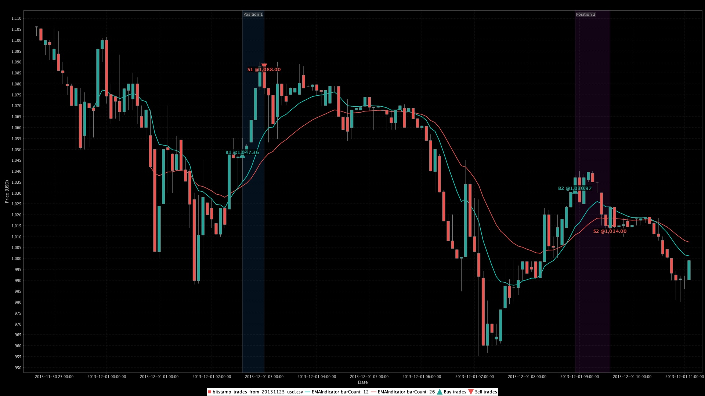
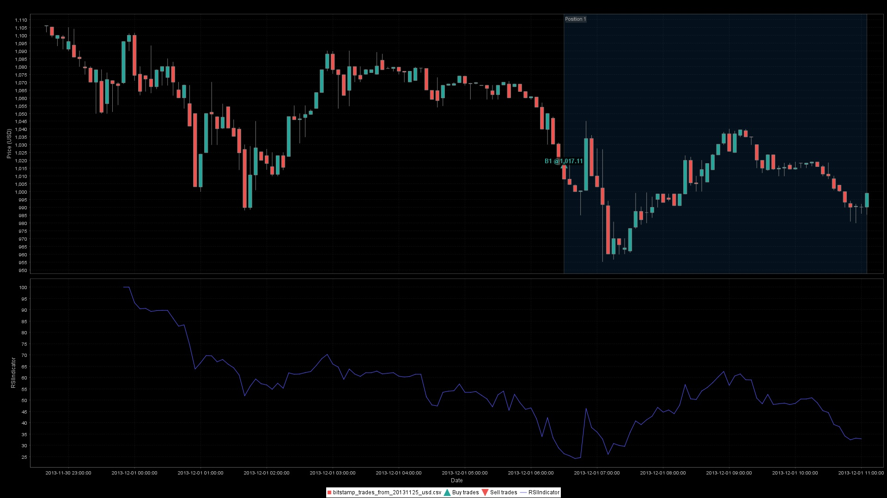
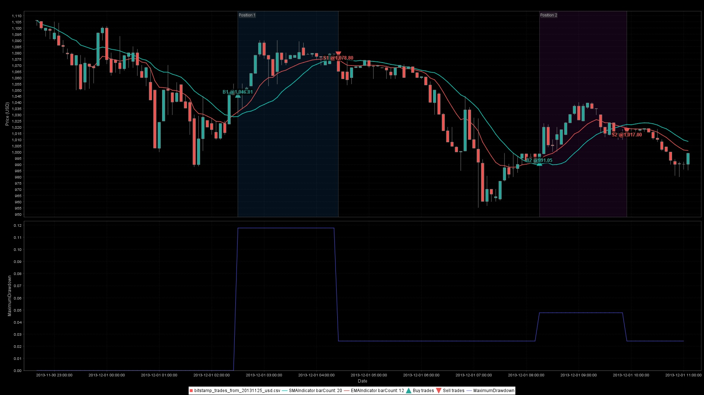
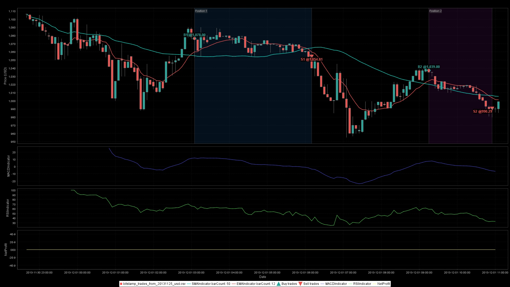

# ta4j  [](https://github.com/ta4j/ta4j/actions/workflows/test.yml) [](https://discord.gg/HX9MbWZ) [](https://opensource.org/licenses/MIT)  

**Technical Analysis for Java**

[Documentation](https://ta4j.github.io/ta4j-wiki/) · [Javadoc](https://ta4j.github.io/ta4j/) · [Examples](ta4j-examples/README.md) · [Discord](https://discord.gg/HX9MbWZ)

ta4j is an open-source Java library for technical analysis and trading-system research. Build indicators and rules, backtest strategies with realistic costs and execution assumptions, inspect the results, and reuse the same strategy logic in live applications.

[Why ta4j?](#why-ta4j) · [Install](#install-in-seconds) · [Quick start](#quick-start-your-first-strategy) · [Workflow](#the-core-workflow) · [Examples](#real-world-examples) · [Contributing](#contributing)

---

## Why ta4j?

ta4j gives Java developers a typed, composable model for market data, indicators, rules, strategies, backtests, analysis, and live-style execution records. It fits naturally into JVM applications and tooling without requiring a Python bridge, a separate service, or a proprietary strategy DSL.

The goal is **reproducible research**, not guaranteed returns. ta4j helps you state a trading idea precisely, test it under explicit assumptions, and understand where the result came from. Market data and broker connectivity remain under your control.

### Features at a glance

| Capability | What it gives you |
| --- | --- |
| **Market-series model** | OHLCV `BarSeries` implementations for ordinary, moving-window, and concurrent workflows |
| **Broad indicator and pattern catalog** | Moving averages, momentum, volatility, volume, candlestick patterns, market structure, and more |
| **Composable strategies** | Fluent `Indicator`, `Rule`, and `Strategy` APIs with no required DSL |
| **Backtesting and research** | Single-strategy runs, large candidate sets, ranking, parameter research, and walk-forward workflows |
| **Execution realism** | Transaction and borrowing costs, slippage, stop-limit fills, position sizing, partial fills, and lot matching |
| **Analysis and presentation** | Risk/return criteria, charting workflows, and JSON serialization support |
| **Forecasting** | Causal forecast-state and projection APIs for Monte Carlo, analog, Kalman, and conformal workflows |
| **Live integration** | Reuse strategy logic while your application owns data ingestion, order routing, reconciliation, and recovery |

## Install in seconds

ta4j requires **Java 25+**. Most applications need only `ta4j-core`:

<!-- TA4J_VERSION_BLOCK:core:stable:begin -->

```xml
<dependency>
  <groupId>org.ta4j</groupId>
  <artifactId>ta4j-core</artifactId>
  <version>0.24.1</version>
</dependency>
```

<!-- TA4J_VERSION_BLOCK:core:stable:end -->

Use `ta4j-examples` for runnable demos, sample data sources, and charting workflows to learn from or copy into your own project. It is not required by `ta4j-core`.

<details>
<summary>Snapshots and the ta4j-examples dependency</summary>

Snapshot builds are published through the Sonatype Central snapshot repository:

<!-- TA4J_VERSION_BLOCK:core:snapshot:begin -->

```xml
<repository>
  <id>central-portal-snapshots</id>
  <url>https://central.sonatype.com/repository/maven-snapshots/</url>
  <releases><enabled>false</enabled></releases>
  <snapshots><enabled>true</enabled></snapshots>
</repository>

<dependency>
  <groupId>org.ta4j</groupId>
  <artifactId>ta4j-core</artifactId>
  <version>0.24.2-SNAPSHOT</version>
</dependency>
```

<!-- TA4J_VERSION_BLOCK:core:snapshot:end -->

Stable examples artifact:

<!-- TA4J_VERSION_BLOCK:examples:stable:begin -->

```xml
<dependency>
  <groupId>org.ta4j</groupId>
  <artifactId>ta4j-examples</artifactId>
  <version>0.24.1</version>
</dependency>
```

<!-- TA4J_VERSION_BLOCK:examples:stable:end -->

Snapshot examples artifact:

<!-- TA4J_VERSION_BLOCK:examples:snapshot:begin -->

```xml
<dependency>
  <groupId>org.ta4j</groupId>
  <artifactId>ta4j-examples</artifactId>
  <version>0.24.2-SNAPSHOT</version>
</dependency>
```

<!-- TA4J_VERSION_BLOCK:examples:snapshot:end -->

</details>

## Quick start: Your first strategy

### Run the included example

```bash
git clone https://github.com/ta4j/ta4j.git
cd ta4j

# Build the reactor once, then run the default Quickstart example.
./mvnw -DskipTests install
./mvnw -pl ta4j-examples exec:java
```

On Windows, use `mvnw.cmd` instead of `./mvnw`. The example loads bundled Bitcoin data, evaluates a strategy, prints performance metrics, and displays a chart when a graphical environment is available.

Run another example by overriding the configured main class:

```bash
./mvnw -pl ta4j-examples exec:java -Dexec.mainClass=ta4jexamples.backtesting.TradingRecordParityBacktest
```

### Use the core API

The essential model is:

> `BarSeries` → `Indicator` → `Rule` → `Strategy` → `TradingRecord`

```java
import org.ta4j.core.BarSeries;
import org.ta4j.core.BaseStrategy;
import org.ta4j.core.Rule;
import org.ta4j.core.Strategy;
import org.ta4j.core.TradingRecord;
import org.ta4j.core.backtest.BarSeriesManager;
import org.ta4j.core.indicators.averages.EMAIndicator;
import org.ta4j.core.indicators.helpers.ClosePriceIndicator;
import org.ta4j.core.rules.CrossedDownIndicatorRule;
import org.ta4j.core.rules.CrossedUpIndicatorRule;

BarSeries series = ...; // Load your OHLCV bars.

ClosePriceIndicator close = new ClosePriceIndicator(series);
EMAIndicator fastEma = new EMAIndicator(close, 12);
EMAIndicator slowEma = new EMAIndicator(close, 26);

Rule entry = new CrossedUpIndicatorRule(fastEma, slowEma);
Rule exit = new CrossedDownIndicatorRule(fastEma, slowEma);
Strategy strategy = new BaseStrategy("EMA crossover", entry, exit);

TradingRecord record = new BarSeriesManager(series).run(strategy);
System.out.printf("Positions: %d%n", record.getPositionCount());
```

The runnable [`Quickstart`](ta4j-examples/src/main/java/ta4jexamples/Quickstart.java) adds data loading, metrics, and charting around this same flow.

## The core workflow

A typical ta4j application follows one path:

> market data → `BarSeries` → indicators → rules → strategy → backtest or live evaluation → metrics and charts

### Sourcing market data

`ta4j-core` works with any OHLCV source. The `ta4j-examples` module includes a shared `BarSeriesDataSource` model and ready-to-run loaders for:

- [Yahoo Finance](ta4j-examples/src/main/java/ta4jexamples/datasources/YahooFinanceHttpBarSeriesDataSource.java) for stocks, ETFs, and crypto
- [Coinbase](ta4j-examples/src/main/java/ta4jexamples/datasources/CoinbaseHttpBarSeriesDataSource.java) for cryptocurrency pairs
- [CSV](ta4j-examples/src/main/java/ta4jexamples/datasources/CsvFileBarSeriesDataSource.java), [JSON](ta4j-examples/src/main/java/ta4jexamples/datasources/JsonFileBarSeriesDataSource.java), and trade-level [Bitstamp CSV](ta4j-examples/src/main/java/ta4jexamples/datasources/BitStampCsvTradesFileBarSeriesDataSource.java)

For production systems, adapt your broker, exchange, database, REST API, or WebSocket feed into bars and keep normalization, gap handling, and corporate-action adjustments explicit.

### Evaluate performance with metrics

Backtests can model costs before you calculate returns and risk:

```java
TradingRecord record = new BarSeriesManager(
        series,
        new LinearTransactionCostModel(0.001),
        new LinearBorrowingCostModel(0.0001))
        .run(strategy);

Num netReturn = new NetReturnCriterion().calculate(series, record);
Num maximumDrawdown = new MaximumDrawdownCriterion().calculate(series, record);
```

Use `TradeExecutionModel` implementations when fill timing, slippage, stop-limit behavior, or partial execution matters. Use `BacktestExecutor` when you need to evaluate and rank many independent strategy candidates. The [backtesting guide](https://ta4j.github.io/ta4j-wiki/Backtesting.html) and [realism checklist](https://ta4j.github.io/ta4j-wiki/Backtesting-Realism-Checklist.html) explain the assumptions that most often invalidate attractive results.

### Visualize and share strategies

Charting helpers live in `ta4j-examples` and build on JFreeChart:

<!-- START_SNIPPET: ema-crossover -->
```java
// Generate simplified chart - just price, indicators, and signals (no subchart)
ChartWorkflow chartWorkflow = new ChartWorkflow();
JFreeChart chart = chartWorkflow.builder()
        .withTitle("EMA Crossover Strategy")
        .withSeries(series) // Price bars (candlesticks)
        .withIndicatorOverlay(fastEma) // Overlay indicators on price chart
        .withIndicatorOverlay(slowEma)
        .withTradingRecordOverlay(record) // Mark entry/exit points with arrows
        .toChart();
chartWorkflow.saveChartImage(chart, series, "ema-crossover-strategy", "output/charts"); // Save as image
```
<!-- END_SNIPPET: ema-crossover -->



<details>
<summary>More charting examples</summary>

RSI in a separate subchart:

<!-- START_SNIPPET: rsi-strategy -->
```java
// Create indicators
ClosePriceIndicator close = new ClosePriceIndicator(series);
RSIIndicator rsi = new RSIIndicator(close, 14);

// RSI strategy: buy when RSI crosses below 30 (oversold), sell when RSI crosses
// above 70 (overbought)
Rule entry = new CrossedDownIndicatorRule(rsi, 30);
Rule exit = new CrossedUpIndicatorRule(rsi, 70);
Strategy strategy = new BaseStrategy("RSI Strategy", entry, exit);
TradingRecord record = new BarSeriesManager(series).run(strategy);

ChartWorkflow chartWorkflow = new ChartWorkflow();
JFreeChart chart = chartWorkflow.builder()
        .withTitle("RSI Strategy with Subchart")
        .withSeries(series) // Price bars (candlesticks)
        .withTradingRecordOverlay(record) // Mark entry/exit points
        .withSubChart(rsi) // RSI indicator in separate subchart panel
        .toChart();
```
<!-- END_SNIPPET: rsi-strategy -->



A performance criterion beside the strategy:

<!-- START_SNIPPET: strategy-performance -->
```java
// Create indicators: multiple moving averages
ClosePriceIndicator close = new ClosePriceIndicator(series);
SMAIndicator sma20 = new SMAIndicator(close, 20);
EMAIndicator ema12 = new EMAIndicator(close, 12);

// Strategy: buy when EMA crosses above SMA, sell when EMA crosses below SMA
Rule entry = new CrossedUpIndicatorRule(ema12, sma20);
Rule exit = new CrossedDownIndicatorRule(ema12, sma20);
Strategy strategy = new BaseStrategy("EMA/SMA Crossover", entry, exit);
TradingRecord record = new BarSeriesManager(series).run(strategy);

ChartWorkflow chartWorkflow = new ChartWorkflow();
JFreeChart chart = chartWorkflow.builder()
        .withTitle("Strategy Performance Analysis")
        .withSeries(series) // Price bars (candlesticks)
        .withIndicatorOverlay(sma20) // Overlay SMA on price chart
        .withIndicatorOverlay(ema12) // Overlay EMA on price chart
        .withTradingRecordOverlay(record) // Mark entry/exit points
        .withSubChart(new MaximumDrawdownCriterion(), record) // Performance metric in subchart
        .toChart();
```
<!-- END_SNIPPET: strategy-performance -->



Multiple indicators and performance layers:

<!-- START_SNIPPET: advanced-strategy -->
```java
// Create indicators
ClosePriceIndicator close = new ClosePriceIndicator(series);
SMAIndicator sma50 = new SMAIndicator(close, 50);
EMAIndicator ema12 = new EMAIndicator(close, 12);
MACDIndicator macd = new MACDIndicator(close, 12, 26);
RSIIndicator rsi = new RSIIndicator(close, 14);

// Strategy: buy when EMA crosses above SMA and RSI > 50, sell when EMA crosses
// below SMA
Rule entry = new CrossedUpIndicatorRule(ema12, sma50).and(new OverIndicatorRule(rsi, 50));
Rule exit = new CrossedDownIndicatorRule(ema12, sma50);
Strategy strategy = new BaseStrategy("Advanced Multi-Indicator Strategy", entry, exit);
TradingRecord record = new BarSeriesManager(series).run(strategy);

ChartWorkflow chartWorkflow = new ChartWorkflow();
JFreeChart chart = chartWorkflow.builder()
        .withTitle("Advanced Multi-Indicator Strategy")
        .withSeries(series) // Price bars (candlesticks)
        .withIndicatorOverlay(sma50) // Overlay SMA on price chart
        .withIndicatorOverlay(ema12) // Overlay indicators on price chart
        .withTradingRecordOverlay(record) // Mark entry/exit points
        .withSubChart(macd) // MACD indicator in subchart
        .withSubChart(rsi) // RSI indicator in subchart
        .withSubChart(new NetProfitLossCriterion(), record) // Net profit/loss performance metric
        .toChart();
```
<!-- END_SNIPPET: advanced-strategy -->



See the [charting guide](https://ta4j.github.io/ta4j-wiki/Charting.html) for layout, export, and time-axis options.

</details>

### From backtest to live trading

The same `Strategy` can evaluate historical or newly arriving bars, but ta4j is not an order-management system. A live integration must:

- choose deliberately between forming-candle and closed-candle evaluation
- call `shouldEnter(index, tradingRecord)` and `shouldExit(index, tradingRecord)`
- record broker-confirmed fills and keep `TradingRecord` synchronized
- deduplicate orders, reconcile state after restart, and handle rejected or partial fills

Start with the [core API decision guide](ta4j-core/README.md), [live-candle semantics](https://ta4j.github.io/ta4j-wiki/Live-Candle-vs-Closed-Candle-Evaluation.html), and the [live trading runbook](https://ta4j.github.io/ta4j-wiki/Live-Trading-Runbook.html).

## Advanced capabilities

### Forecasting

Forecast indicators stay inside the normal `Indicator` model while producing a distribution at a fixed future horizon. A forecast evaluated at index `i` reads source values only through `i`, so it can later be compared with the realized value at `i + horizon` without look-ahead leakage.

```java
LogReturnIndicator returns = new LogReturnIndicator(series);
ReturnForecastStateIndicator<ReturnForecastState> state =
        new EwmaReturnForecastStateIndicator(returns);

ForecastProjectionIndicator fiveBarForecast =
        new MonteCarloPriceForecastIndicator(state, 5);

Indicator<Num> median = fiveBarForecast.median();
Indicator<Num> downside = fiveBarForecast.quantile(0.05);
```

Use deterministic seeds and explicit projection indicators when results must be repeatable. The examples module includes complete [rolling conformal](ta4j-examples/src/main/java/ta4jexamples/analysis/forecast/RollingConformalForecastExample.java) and [kinematic Kalman](ta4j-examples/src/main/java/ta4jexamples/analysis/forecast/KinematicKalmanForecastExample.java) walkthroughs.

### Strategy and component serialization

Supported indicators, rules, and strategies can be serialized for persistence, sharing, and integration with other systems.

<details>
<summary>JSON serialization examples</summary>

<!-- START_SNIPPET: serialize-indicator -->
```java
// Serialize an indicator (RSI) to JSON
ClosePriceIndicator close = new ClosePriceIndicator(series);
RSIIndicator rsi = new RSIIndicator(close, 14);
String rsiJson = rsi.toJson();
LOG.info("Output: {}", rsiJson);
// Output:
// {"type":"RSIIndicator","parameters":{"barCount":14},"components":[{"type":"ClosePriceIndicator"}]}
```
<!-- END_SNIPPET: serialize-indicator -->

<!-- START_SNIPPET: serialize-rule -->
```java
// Serialize a rule (AndRule) to JSON
Rule rule1 = new OverIndicatorRule(rsi, 50);
Rule rule2 = new UnderIndicatorRule(rsi, 80);
Rule andRule = new AndRule(rule1, rule2);
String ruleJson = ComponentSerialization.toJson(RuleSerialization.describe(andRule));
LOG.info("Output: {}", ruleJson);
// Output:
// {"type":"AndRule","label":"AndRule","components":[{"type":"OverIndicatorRule","label":"OverIndicatorRule","components":[{"type":"RSIIndicator","parameters":{"barCount":14},"components":[{"type":"ClosePriceIndicator"}]}],"parameters":{"threshold":50.0}},{"type":"UnderIndicatorRule","label":"UnderIndicatorRule","components":[{"type":"RSIIndicator","parameters":{"barCount":14},"components":[{"type":"ClosePriceIndicator"}]}],"parameters":{"threshold":80.0}}]}
```
<!-- END_SNIPPET: serialize-rule -->

<!-- START_SNIPPET: serialize-strategy -->
```java
// Serialize a strategy (EMA Crossover) to JSON
EMAIndicator fastEma = new EMAIndicator(close, 12);
EMAIndicator slowEma = new EMAIndicator(close, 26);
Rule entry = new CrossedUpIndicatorRule(fastEma, slowEma);
Rule exit = new CrossedDownIndicatorRule(fastEma, slowEma);
Strategy strategy = new BaseStrategy("EMA Crossover", entry, exit);
String strategyJson = strategy.toJson();
LOG.info("Output: {}", strategyJson);
// Output: {"type":"BaseStrategy","label":"EMA
// Crossover","parameters":{"unstableBars":0},"rules":[{"type":"CrossedUpIndicatorRule","label":"entry","components":[{"type":"EMAIndicator","parameters":{"barCount":12},"components":[{"type":"ClosePriceIndicator"}]},{"type":"EMAIndicator","parameters":{"barCount":26},"components":[{"type":"ClosePriceIndicator"}]}]},{"type":"CrossedDownIndicatorRule","label":"exit","components":[{"type":"EMAIndicator","parameters":{"barCount":12},"components":[{"type":"ClosePriceIndicator"}]},{"type":"EMAIndicator","parameters":{"barCount":26},"components":[{"type":"ClosePriceIndicator"}]}]}]}
```
<!-- END_SNIPPET: serialize-strategy -->

Restore supported components with `Indicator.fromJson(series, json)` and `Strategy.fromJson(series, json)`. See [migration and version compatibility](https://ta4j.github.io/ta4j-wiki/Migration-and-Version-Compatibility.html) before persisting descriptors across releases.

</details>

### Specialized research tools

Beyond the basic strategy loop, ta4j includes building blocks for batch backtests, parameter research, position sizing, causal swing detection, rolling correlations, regime-aware rules, candlestick patterns, Elliott Wave analysis, LPPL residuals, streaming trade ingestion, and fill-aware live records.

These capabilities are intentionally not expanded into mini-manuals here. Use the [examples index](ta4j-examples/README.md), [core API guide](ta4j-core/README.md), [Javadoc](https://ta4j.github.io/ta4j/), and [wiki](https://ta4j.github.io/ta4j-wiki/) to go deeper without losing the onboarding path.

### Performance

ta4j lets you choose `DecimalNum` for precision-first workflows or `DoubleNum` for throughput-first workflows with accepted floating-point tradeoffs. Moving series can cap retained history, indicator values are cached, and independent strategy candidates can be evaluated in parallel.

Measure changes on your own workload rather than relying on generic claims. Use the [`BacktestPerformanceTuningHarness`](ta4j-examples/src/main/java/ta4jexamples/backtesting/BacktestPerformanceTuningHarness.java), the [Num guide](https://ta4j.github.io/ta4j-wiki/Num.html), and [Performance Characterization](https://ta4j.github.io/ta4j-wiki/Performance-Characterization.html) for repeatable comparisons.

## Real-world examples

The `ta4j-examples` module is organized as progressive learning tracks:

| Goal | Start here |
| --- | --- |
| First strategy and metrics | [`Quickstart`](ta4j-examples/src/main/java/ta4jexamples/Quickstart.java), [`StrategyAnalysis`](ta4j-examples/src/main/java/ta4jexamples/analysis/StrategyAnalysis.java) |
| Data sourcing | [`YahooFinanceBacktest`](ta4j-examples/src/main/java/ta4jexamples/backtesting/YahooFinanceBacktest.java), [`CoinbaseBacktest`](ta4j-examples/src/main/java/ta4jexamples/backtesting/CoinbaseBacktest.java) |
| Execution semantics | [`TradingRecordParityBacktest`](ta4j-examples/src/main/java/ta4jexamples/backtesting/TradingRecordParityBacktest.java), [`TradeFillRecordingExample`](ta4j-examples/src/main/java/ta4jexamples/backtesting/TradeFillRecordingExample.java) |
| Parameter research | [`SimpleMovingAverageRangeBacktest`](ta4j-examples/src/main/java/ta4jexamples/backtesting/SimpleMovingAverageRangeBacktest.java), [`RelationshipObjectiveSearchExample`](ta4j-examples/src/main/java/ta4jexamples/research/RelationshipObjectiveSearchExample.java) |
| Forecasting and calibration | [`RollingConformalForecastExample`](ta4j-examples/src/main/java/ta4jexamples/analysis/forecast/RollingConformalForecastExample.java), [`KinematicKalmanForecastExample`](ta4j-examples/src/main/java/ta4jexamples/analysis/forecast/KinematicKalmanForecastExample.java) |
| Forecasting and robustness | [`CorrentropyKalmanExample`](ta4j-examples/src/main/java/ta4jexamples/analysis/forecast/CorrentropyKalmanExample.java) demonstrates ATR-derived Q/R, the robust estimate, residual, and measurement weight on an ossified S&P 500 weekly series |
| Charting and diagnostics | [`IndicatorsToChart`](ta4j-examples/src/main/java/ta4jexamples/indicators/IndicatorsToChart.java), [`CashFlowToChart`](ta4j-examples/src/main/java/ta4jexamples/analysis/CashFlowToChart.java) |

See [`ta4j-examples/README.md`](ta4j-examples/README.md) for the complete learning sequence and runnable commands.

## Documentation

New to ta4j? Follow the [Canonical User Journey](https://ta4j.github.io/ta4j-wiki/Canonical-User-Journey.html) and run the examples in order. Moving from exploration to serious research? Apply the [realism checklist](https://ta4j.github.io/ta4j-wiki/Backtesting-Realism-Checklist.html) before trusting a result. Moving toward live execution? Build around the [live trading runbook](https://ta4j.github.io/ta4j-wiki/Live-Trading-Runbook.html), especially its reconciliation and recovery guidance.

| Need | Resource |
| --- | --- |
| A guided first hour | [Canonical User Journey](https://ta4j.github.io/ta4j-wiki/Canonical-User-Journey.html) |
| Core API and execution choices | [`ta4j-core/README.md`](ta4j-core/README.md) |
| Runnable examples | [`ta4j-examples/README.md`](ta4j-examples/README.md) |
| Backtesting concepts | [Backtesting guide](https://ta4j.github.io/ta4j-wiki/Backtesting.html) |
| Research quality gate | [Backtesting Realism Checklist](https://ta4j.github.io/ta4j-wiki/Backtesting-Realism-Checklist.html) |
| Live operations | [Live Trading Runbook](https://ta4j.github.io/ta4j-wiki/Live-Trading-Runbook.html) |
| API changes | [Migration and Version Compatibility](https://ta4j.github.io/ta4j-wiki/Migration-and-Version-Compatibility.html) |
| Troubleshooting | [Troubleshooting Hub](https://ta4j.github.io/ta4j-wiki/Troubleshooting-Hub.html) |
| Complete API reference | [Javadoc](https://ta4j.github.io/ta4j/) |

## Community & support

- [Discord](https://discord.gg/HX9MbWZ) for usage questions and design discussion
- [GitHub Issues](https://github.com/ta4j/ta4j/issues) for reproducible bugs and feature requests
- [Documentation wiki](https://ta4j.github.io/ta4j-wiki/) for guides and operational references
- [Javadoc](https://ta4j.github.io/ta4j/) for API-level detail

## Contributing

Read the [contribution guide](.github/CONTRIBUTING.md), [Code of Conduct](CODE_OF_CONDUCT.md), and [roadmap](https://ta4j.github.io/ta4j-wiki/Roadmap-and-Tasks.html). Contributions should include focused tests and an appropriate `CHANGELOG.md` entry.

Contributor reference:

- [Build commands: Maven](#build-commands-maven)

### Build commands: Maven

<details>
<summary>Contributor build and verification commands</summary>

The repository requires Java 25+ and includes Maven Wrapper scripts pinned to Maven 3.9.16.

- Standard wrapper: use `./mvnw ...` on macOS/Linux, `mvnw.cmd ...` on Windows, or system Maven 3.9+ intentionally.
- Canonical quality gate: Use `scripts/run-full-build-quiet.sh` on macOS/Linux/Git Bash/WSL or `scripts/run-full-build-quiet.ps1` on Windows PowerShell with Git Bash available on `PATH`.
- Maven-only repair and verification: `./mvnw -B clean license:format spotless:apply verify -Dta4j.excludedTestTags=analysis-demo,benchmark,requires-cuda,requires-metal,requires-opencl,requires-display,requires-headless`
- CI-equivalent validation: `./mvnw -B clean license:check spotless:check verify -Dta4j.excludedTestTags=analysis-demo,benchmark,requires-cuda,requires-metal,requires-opencl,requires-display,requires-headless`
- Focused formatting repair: `./mvnw -B license:format spotless:apply`
- SpotBugs gate: `./mvnw -pl ta4j-core -am clean compile spotbugs:check`
- JaCoCo gate: `./mvnw -pl ta4j-core -am test jacoco:report jacoco:check`
- Focused coverage report: `./mvnw -pl ta4j-core -am -Dtest=BarSeriesManagerTest -Dsurefire.failIfNoSpecifiedTests=false test jacoco:report`

Run the full quality path before opening or updating a pull request and review any license-header or formatting repairs before committing them. Eclipse users can import `code-formatter.xml`; IntelliJ users should use an Eclipse-format-profile integration. Maven remains the authoritative formatter entrypoint.

</details>

### Release & snapshot publishing

Snapshot and stable publishing are automated. Maintainers should use [`RELEASE_PROCESS.md`](RELEASE_PROCESS.md) for the supported release path, recovery procedures, required configuration, and audit artifacts.

## License and risk

ta4j is released under the [MIT License](https://opensource.org/licenses/MIT). It is provided as-is, without a warranty or any promise of correctness, profitability, or fitness for a particular purpose. Backtests are models of the assumptions you encode; they are not evidence that future trading will be profitable.

## Powered by

[](https://jb.gg/OpenSource)

<a href="https://github.com/ta4j/ta4j/graphs/contributors">
  
</a>
